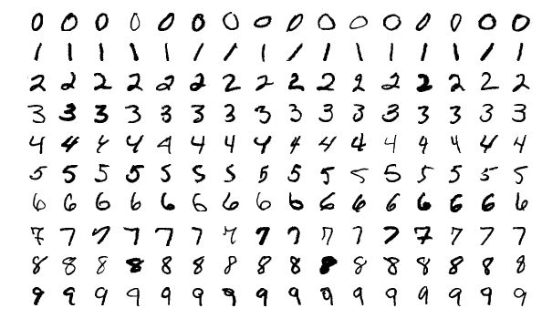
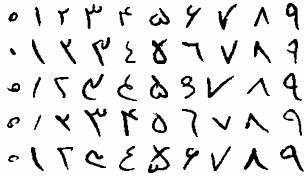

In the name of God

# LeNet-5
This repository contains implementation of [LeNet-5](http://yann.lecun.com/exdb/publis/pdf/lecun-98.pdf) (Handwritten
Character Recognition) by Tensorflow and the network tested with the [mnist dataset](http://yann.lecun.com/exdb/mnist/)
and [hoda dataset](http://farsiocr.ir/مجموعه-داده/مجموعه-ارقام-دستنویس-هدی).


# Training mnist dataset
To train the network with mnist dataset, type the following command at the command prompt:
```
python3 ./train_mnist.py
```

Sample images from mnist dataset:



## Results

### Epoch 0
```
Train Accuracy = 0.121
Test Accuracy = 0.121
Validation Accuracy = 0.128
```

### Epoch 1
```
Train Accuracy = 0.963
Test Accuracy = 0.966
Validation Accuracy = 0.964
```

### Epoch 2
```
Train Accuracy = 0.976
Test Accuracy = 0.976
Validation Accuracy = 0.977
```

...

### Epoch 50
```
Train Accuracy = 1.000
Test Accuracy = 0.992
Validation Accuracy = 0.992
```

...

### Epoch 100
```
Final Train Accuracy = 1.000
Final Test Accuracy = 0.992
Final Validation Accuracy = 0.993
```

# Evaluating mnist dataset
To evaluate the network with mnist dataset, type the following command at the command prompt:
```
python3 ./evaluate_mnist.py
```

# Training hoda dataset
To train the network with hoda dataset, type the following command at the command prompt:
```
python3 ./train_hoda.py
```

Sample images from hoda dataset:



## Results

### Epoch 0
```
Train Accuracy = 0.093
Test Accuracy = 0.110
Remaining Accuracy = 0.101
```

### Epoch 1
```
Train Accuracy = 0.982
Test Accuracy = 0.962
Remaining Accuracy = 0.967
```

### Epoch 2
```
Train Accuracy = 0.986
Test Accuracy = 0.972
Remaining Accuracy = 0.977
```

...

### Epoch 50
```
Train Accuracy = 1.000
Test Accuracy = 0.992
Remaining Accuracy = 0.994
```

...

### Epoch 100
```
Final Train Accuracy = 1.000
Final Test Accuracy = 0.993
Final Remaining Accuracy = 0.995
```

# Evaluating hoda dataset
To evaluate the network with hoda dataset, type the following command at the command prompt:
```
python3 ./evaluate_hoda.py
```

# Dependencies
* Python 3
* numpy
* opencv-python
* tensorflow

# Links
* http://yann.lecun.com/exdb/lenet/
* http://yann.lecun.com/exdb/publis/pdf/lecun-98.pdf
* http://yann.lecun.com/exdb/mnist/
* http://farsiocr.ir/مجموعه-داده/مجموعه-ارقام-دستنویس-هدی
* http://dadegan.ir/catalog/hoda
* https://www.tensorflow.org/
* https://github.com/amir-saniyan/HodaDatasetReader
* https://github.com/amir-saniyan/LeNet-5
